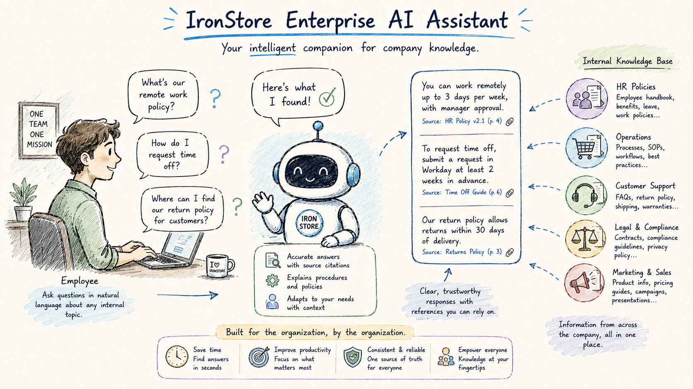

# Mini-Project — IronStore Enterprise AI Assistant

Build an AI-powered enterprise assistant that enables employees to access internal company knowledge through natural language.

## Your task:

- Build an AI assistant that helps employees quickly access internal company knowledge through a conversational interface.
- The assistant should answer questions, explain internal procedures, and assist with everyday work tasks by using the organization's proprietary information. It should provide clear, accurate, and trustworthy responses, helping employees find information efficiently while acknowledging when it cannot confidently answer a question.
- The goal is to create a practical internal assistant that improves productivity, reduces time spent searching for information, and provides a consistent experience across the organization.

## The data

Your team has collected a set of internal company documents from different departments.

These documents are available in the `documents` directory. Explore the available data and determine how it can be used to build an assistant capable of answering employees' questions accurately and reliably.

The dataset has been synthetically generated, as this type of internal company information is typically not publicly available. However, it has been designed to be as realistic as possible and to resemble the kinds of documents you would encounter in a real organization.

Keep in mind that, as with many real-world document collections, the data may contain inconsistencies, duplicated content, or outdated information. Your solution should handle these situations as effectively as possible.